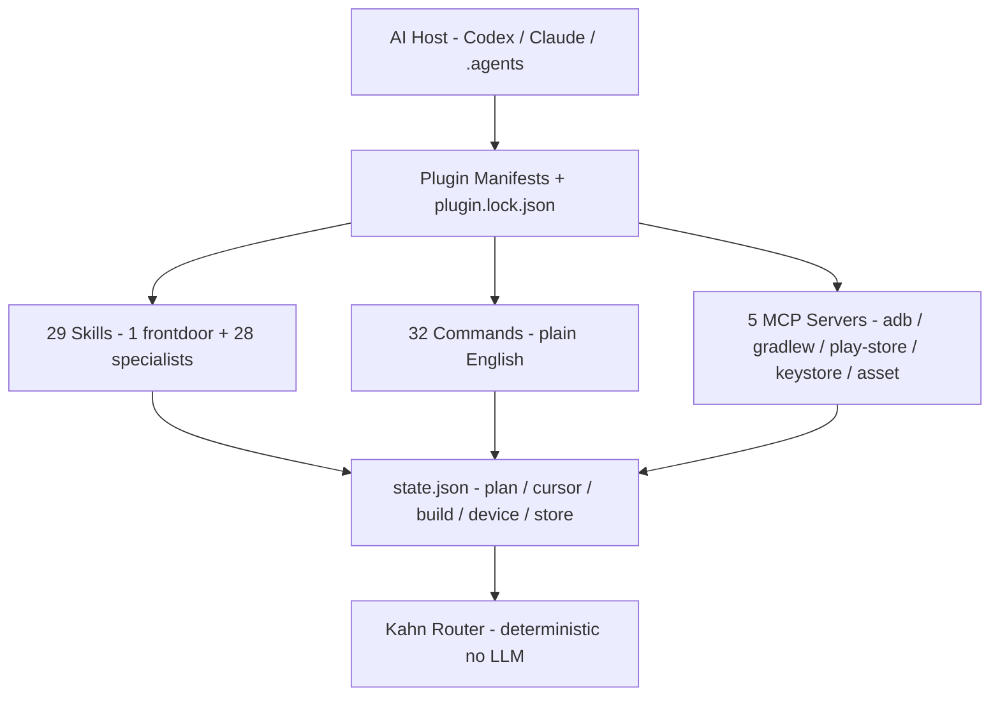

<p align="center">
  <a href="https://github.com/mitunmanav/build-android-apps">
    
  </a>
</p>

<h1 align="center">Build Android Apps</h1>

<p align="center">
  <strong>Describe the app in one sentence. Get a working app on Google Play.</strong><br/>
  No Kotlin. No Gradle. No Console maze.
</p>

<p align="center">
  <a href="LICENSE"></a>
  <a href="CHANGELOG.md"></a>
  <a href="SPEC.md"></a>
  
  
  <a href="https://github.com/mitunmanav/build-android-apps/stargazers"></a>
</p>

<p align="center">
  <a href="#quick-start">Quick start</a> •
  <a href="#how-it-works">How it works</a> •
  <a href="#install">Install</a> •
  <a href="docs/SKILLS-CATALOG.md">Skills</a> •
  <a href="commands/">Commands</a> •
  <a href="docs/INSTALL_MATRIX.md">All hosts</a> •
  <a href="CONTRIBUTING.md">Contributing</a> •
  <a href="SPEC.md">Spec</a>
</p>

---

> **Built for non-technical builders** — indie founders, vibe coders, facilitators.
> If you can describe the app, the plugin can build it.

```text
/make-app "a habit tracker with daily reminders and streaks"
# → asks a few questions → writes spec → plans → scaffolds → builds → previews → ships
```

---

## Quick start

You handle the Google paperwork: **Play Console account ($25) + ID verification + banking**.
The plugin handles everything else: SDK, Gradle, signing, store listing, upload.

```bash
/setup                                           # first-run wizard: JDK/SDK/adb/device/Play/keystore (~30 min)
/make-app "a habit tracker with daily reminders"  # intake → spec → scaffold
/run-plan                                         # hands-free build with reviews + device checks
/preview                                          # install + launch + screenshot
/publish                                          # gated → signed AAB → Play internal track
```

Taking over a Lovable / Bolt / v0 / Cursor app? `/import` → `/audit` → `/finish`.
Mid-build changes: `/add` · `/change` · `/remove` · `/where` · `/undo` · `/continue`.

---

## How it works



One frontdoor skill (`$build-android-apps`) routes plain English to the right specialist.
Every project gets `<project>/.build-android/state.json`, so `/where` works after you close the laptop.
Details: [`docs/ARCHITECTURE.md`](docs/ARCHITECTURE.md) · [`SPEC.md`](SPEC.md)

---

## What you get

| You say | Plugin does |
|---|---|
| `a habit tracker` | Intake → spec → plan → Compose scaffold with signing + Crashlytics |
| `/preview` | Install → launch → screenshot on your device |
| `/publish` | Safety gate → signed AAB → Play internal track |
| `add dark mode` | Updates the plan, re-runs only affected steps |

---

## Install

**Codex CLI** (v0.122+)

```bash
codex plugin marketplace add mitunmanav/build-android-apps
codex plugin add build-android-apps@build-android-apps
```

**Claude Code CLI**

```bash
claude plugin marketplace add mitunmanav/build-android-apps
claude plugin install build-android-apps@build-android-apps
```

**.agents hosts** (VS Code Copilot / Cursor / Gemini CLI)

```bash
git clone https://github.com/mitunmanav/build-android-apps ~/.agents/plugins/build-android-apps
# restart host
```

Verify: `bash scripts/smoke.sh`. All hosts: [`docs/INSTALL_MATRIX.md`](docs/INSTALL_MATRIX.md).
No telemetry — local `adb`/Gradle/Play API only.

---

## Compatibility

Pinned: [`android-scaffold/references/versions-pinned.md`](skills/android-scaffold/references/versions-pinned.md)

| AGP | Gradle | Kotlin | Compose BOM | M3 | min SDK | JVM |
|---|---|---|---|---|---|---|
| 8.7+ | 8.9+ | 2.0.21 | 2024.12.01 | 1.3.1 | 26 (Android 8) | 17 |

---

## Limitations

| Out of scope | Today |
|---|---|
| iOS, Wear, TV, Auto, XR | Sibling plugins planned |
| Custom backend hosting | Firebase + Supabase templates |
| Multi-user projects | Single-user `state.json` |
| AGP 9.x | 8.7 stable (state schema v2 shipped) |

---

## Contributing

PRs welcome. `bash scripts/smoke.sh` must pass. Update `CHANGELOG.md` + `SPEC.md` if behavior changed.
Apache-2.0, author **Mitun only** — no `Co-authored-by`.

See [`CONTRIBUTING.md`](CONTRIBUTING.md) · [`SECURITY.md`](SECURITY.md) for vulnerability reporting.

---

## License and author

[Apache-2.0](LICENSE) · [PRIVACY.md](PRIVACY.md) · [TERMS.md](TERMS.md)

**Mitun** — [github.com/mitunmanav](https://github.com/mitunmanav)

<p align="center"><sub><a href="https://github.com/mitunmanav/build-android-apps/issues">Issues</a> · <a href="https://github.com/mitunmanav/build-android-apps/discussions">Discussions</a> · <a href="CHANGELOG.md">Changelog</a> · <a href="SPEC.md">Spec</a></sub></p>
