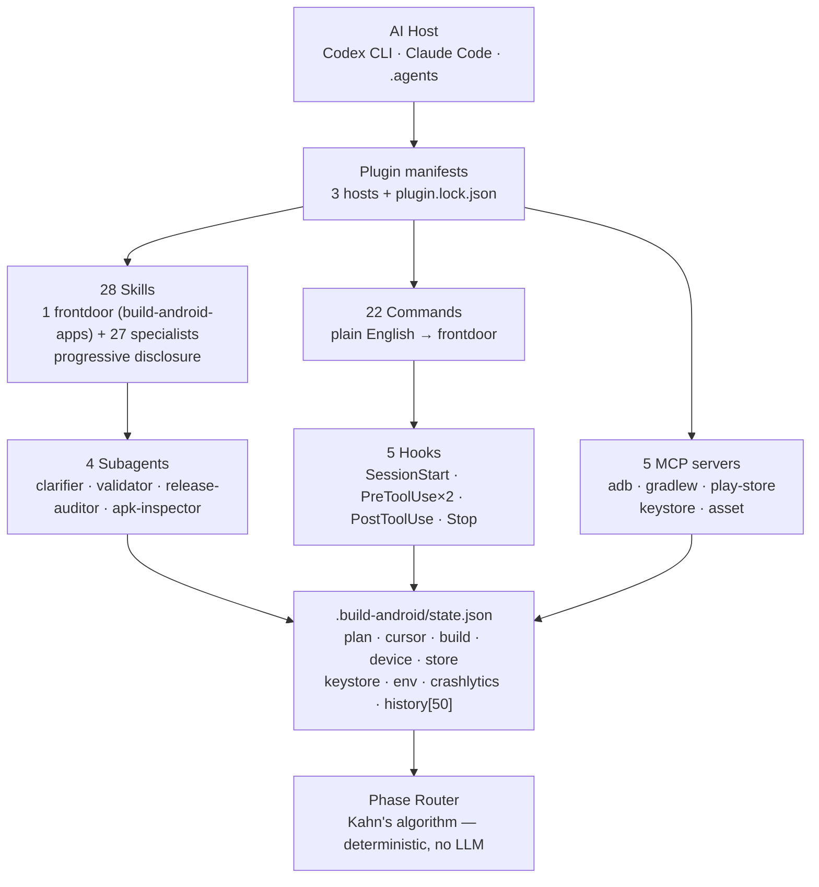

<p align="center">
  <a href="https://github.com/mitunmanav/build-android-apps">
    
  </a>
</p>

<h1 align="center">Build Android Apps</h1>

<p align="center">
  <strong>The only plugin you need to build & ship Android apps from your AI assistant.</strong><br/>
  One prompt → working app → signed AAB on Play Store. No Kotlin. No Gradle. No Console maze.
</p>

<p align="center">
  <a href="LICENSE"></a>
  <a href="CHANGELOG.md"></a>
  <a href="SPEC.md"></a>
  
  
  <a href="https://github.com/mitunmanav/build-android-apps/stargazers"></a>
</p>

<p align="center">
  <a href="#quick-start">Quick start</a> •
  <a href="#how-it-works">How it works</a> •
  <a href="#features">Features</a> •
  <a href="#skills-28">Skills</a> •
  <a href="#commands-22">Commands</a> •
  <a href="#install">Install</a> •
  <a href="SPEC.md">Spec</a> •
  <a href="docs/ARCHITECTURE.md">Architecture</a> •
  <a href="CHANGELOG.md">Changelog</a>
</p>

<p align="center">
  <sub>If this saves you a weekend, please <a href="https://github.com/mitunmanav/build-android-apps">⭐ star the repo</a> — it helps others find it.</sub>
</p>

---

> **Built for vibe coders, indie founders, and facilitators** — not Android engineers.
> If you can describe the app in one sentence, this plugin can build it.

```text
/make-app "a habit tracker with daily reminders and streaks"
# → asks 3 questions → writes spec → plans → scaffolds → builds → previews → ships
```

<details>
<summary><strong>📑 Contents</strong></summary>

- [Why this plugin?](#why-this-plugin)
- [Demo](#demo)
- [Quick start](#quick-start)
- [How it works](#how-it-works)
- [Features](#features)
- [Skills (28)](#skills-28)
- [Commands (22)](#commands-22)
- [MCP servers (5)](#mcp-servers-5)
- [Install](#install)
- [Compatibility](#compatibility)
- [Limitations and roadmap](#limitations-and-roadmap)
- [Pairs with](#pairs-with)
- [FAQ](#faq)
- [Contributing](#contributing)
- [Security](#security)
- [License and author](#license-and-author)

</details>

---

## ✨ Why this plugin?

**You type the idea. The plugin handles the rest** — scaffold, state, signing, store listing, upload — and remembers where you left off.

| You say | Plugin does |
|---|---|
| `a habit tracker` | Intake → spec → plan (**Kahn's algorithm**, no LLM) → Compose scaffold with signing + Crashlytics |
| `/preview` | `adb` install → launch → screenshot → annotated layout dump |
| `/publish` | Pre-submit gate → signed AAB → Play Store **internal track** → draft URL |
| `add dark mode` mid-build | Mutates `state.json` → re-routes **only affected phases** |

**Resumable by design.** Every project gets `<project>/.build-android/state.json` (gitignored). `/add`, `/change`, `/undo`, `/where`, `/continue` all operate on that single source of truth — close your laptop, come back, `/where` tells you exactly where you left off.

### How it compares

|  | `android/skills` (Google, 7k★) | `test-android-apps` (OpenAI) | `ayush016` | **This plugin** |
|---|---|---|---|---|
| **Coverage** | 16 domain SKILLs (knowledge only) | Testing / profiling only | Team standards | **Full lifecycle: intake → ship → update** |
| **Tooling** | Skills only | 2 skills + scripts | 1 SKILL + 17 refs | **28 skills (1 frontdoor + 27) + 22 commands + 5 MCP + 5 hooks** |
| **Shipping** | No | No | No | **Yes** — `/publish` → Play Store |
| **Resumable** | No | No | No | **Yes** — `state.json` + deterministic router |
| **Cold-start** | No | No | No | **Yes** — `/setup` wizard (10 steps) |
| **Target** | Any AI assistant | Test engineers | Android leads | **Non-technical vibe coders** |

> Complements, does not replace. Pair with Google's first-party skills for deeper domain coverage: `android skills add --all`.

---

## 🎬 Demo

<p align="center">
  <!-- Replace with your recording: assets/demo.gif or assets/demo.mp4 -->
  
  <br/>
  <sub>📹 <em>Demo placeholder</em> — record a 30s terminal capture (<code>asciinema</code>, <code>terminalizer</code>, or screen record) and save as <code>assets/demo.gif</code>. Recommended flow: <code>/setup</code> → <code>/make-app "habit tracker…"</code> → <code>/preview</code> → <code>/publish</code>.</sub>
</p>

```text
$ /setup
  ✓ JDK 17 found
  ✓ Android SDK 35 installed
  ✓ adb in PATH
  ✓ Device Pixel 8 connected (adb: R5CT...)
  → service-account JSON saved to .build-android/play-service.json
  → upload keystore generated (SHA256: AB:CD:... keep it backed up!)

$ /make-app "a habit tracker with daily reminders and streaks"
  → clarifier asks 3 questions → spec written → plan: 7 tasks
  → scaffold → build → install → screenshot

$ /preview
  → installed com.example.habittracker (assembleDebug 4.2s)
  → screenshot: .build-android/preview-001.png + layout dump

$ /publish
  → gate: keystore ✓ listing ✓ screenshots ✓
  → signed AAB → Play internal track → https://play.google.com/console/.../draft/abc123
```

---

## 🚀 Quick start

> Prerequisites are **auto-detected on SessionStart**. Missing anything? `/setup` installs/fixes it.

**You need:** JDK 17+ · Android SDK 35 · `adb` · Python 3.10+ · Play Console account ($25 once) · service-account JSON

```bash
# 1 — one-time setup (~30 min, guided, resumable)
#    walks you through: OS check → JDK/SDK/adb → device/AVD → Play Console → service account → keystore
/setup

# 2 — build your first app (no Kotlin/Gradle needed)
/make-app "a habit tracker with daily reminders"

# 3 — see it on device (install + launch + screenshot)
/preview

# 4 — ship to Play Store (internal track, gated)
/publish
```

<details>
<summary><strong>Regain control of an existing project?</strong></summary>

Built your app elsewhere (Lovable / Bolt / v0 / Cursor / Replit)? Let the plugin take ownership:

```bash
/import   # snapshot → audit → gap list (rollback-safe)
/audit    # deep Play Store readiness check
/finish   # auto-fill gaps → publish
```

</details>

<details>
<summary><strong>Mid-flight changes without restart</strong></summary>

```bash
/add "user profiles with avatars"   # patches plan, only affected phases re-run
/change "make streaks weekly not daily"
/remove "onboarding screen"
/where                              # what phase, what's next, what blocks
/continue                           # resume
/undo                               # roll back last mutation
```

</details>

---

## 🧭 How it works



**Every `/add` / `/change` / `/remove` / `/undo` mutates `state.json`.** `/where` reads it. The router computes the minimal phase sequence to run — deterministically, no LLM call.

| Concept | Detail |
|---|---|
| **Progressive disclosure** | Only frontdoor `build-android-apps` loads at startup (under Codex 2%/8k budget). Specialists lazy-load on delegation. |
| **Deterministic routing** | `delta = your request` → mark affected `task.phases` → Kahn's topological sort → ordered phases. Same input → same plan. |
| **Resumable loop** | Six rules: plan is source of truth, add/remove is first-class, re-entering a phase is idempotent, `STOP` preserves partial state, `SessionStart` re-hydrates `phase X step Y`. |

Deep dive: [`docs/ARCHITECTURE.md`](docs/ARCHITECTURE.md) · Spec: [`SPEC.md`](SPEC.md) · State schema: [`state/README.md`](state/README.md)

---

## 🌟 Features

|  | Capability | What you get |
|---|---|---|
| **💬** | **One-liner to app** | `/make-app "<idea>"` → intake (1–5 plain-English questions) → spec → sequenced plan → scaffold |
| **🔀** | **Mid-flight without restart** | `/add` / `/change` / `/remove` / `/undo` patch the plan; only affected phases re-run |
| **📱** | **Real device loop** | `/preview` + `/debug` drive `adb` (install, logcat, JDWP, layout dump) with a 3-strike auto-fix |
| **✅** | **Ship with confidence** | `/publish` gated by `PreToolUse` on `play-store` MCP (keystore, listing, screenshots must exist). `/why-rejected` diagnoses Play rejections by file |
| **🎨** | **Store assets from code** | `asset-mcp` generates launcher icons (5 densities + adaptive), feature graphic, screenshots — no designer needed |
| **🔁** | **Take ownership** | `/import` snapshots first, then audits any Lovable / Bolt / v0 / Cursor-built project — and `/finish` fills gaps |

> [!TIP]
> Use **`$build-android-apps`** for everything (it routes). You never need to name a specialist skill directly — just describe what you want in plain English.

---

## 🧩 Skills (28)

> **1 frontdoor `build-android-apps` + 27 specialists**, each `skills/<name>/SKILL.md` + `references/`. **Use `$build-android-apps`** — it intent-classifies and delegates; specialists are lazy-loaded. Keeps startup under the 8k budget. Full catalog: [`docs/SKILLS-CATALOG.md`](docs/SKILLS-CATALOG.md)

<details open>
<summary><strong>Lifecycle — intake → plan → scaffold → run → ship</strong></summary>

| Skill | Purpose | MCP |
|---|---|---|
| `app-intake` | Vague prompt → concrete spec (1–5 questions) | state |
| `app-planner` | Spec → sequenced plan in `state.json` | state |
| `android-scaffold` | Gradle + Compose + signing + Crashlytics | gradlew |
| `android-run` | Install + launch + screenshot | adb |
| `android-debug-fix` | Logcat → localize → minimal fix (3-strike) | adb |
| `setup-wizard` | 10-step first-run onboarding | gradlew, play-store |

</details>

<details>
<summary><strong>App quality — UI · perf · test · edge-to-edge</strong></summary>

| Skill | Purpose | MCP |
|---|---|---|
| `compose-ui-patterns` | Lists, nav, forms, state hoisting | — |
| `compose-performance-audit` | Recomposition, stability, baseline profiles | gradlew |
| `compose-view-refactor` | View → Compose migration | — |
| `material3-expressive` | M3 expressive theming + motion | — |
| `android-edge-to-edge` | SDK 35 mandatory edge-to-edge | — |
| `android-test` *(via templates)* | Screenshot grid (400/610/900 × 400/500/1000 dp) | gradlew |

</details>

<details>
<summary><strong>Data, auth & platform</strong></summary>

| Skill | Purpose | MCP |
|---|---|---|
| `android-backend` | Room + DataStore + Supabase / Firebase | — |
| `android-auth` | Credential Manager, Google, passkey | — |
| `android-ops` | FCM, Analytics, WorkManager, Crashlytics | — |
| `android-media` | CameraX + Media3 ExoPlayer | — |
| `android-app-functions` | App Functions exposure | — |
| `android-restore-credentials` | Cross-device restore keys | — |
| `android-verified-email` | OTP-less SD-JWT verification | — |

</details>

<details>
<summary><strong>Shipping & optimization</strong></summary>

| Skill | Purpose | MCP |
|---|---|---|
| `android-icons-assets` | Icons (5 densities) + adaptive + feature graphic | asset |
| `android-store-listing` | Title, desc, screenshots, privacy, data safety | — |
| `android-publish-update` | Version bump + changelog + signed AAB + re-upload | play-store, keystore |
| `android-r8-analyzer` | APK size + keep-rule audit (30-line cap) | gradlew |
| `android-importer` | Own a foreign-built project (snapshot + audit) | gradlew |

</details>

<details>
<summary><strong>Diagnostics</strong></summary>

| Skill | Purpose | MCP |
|---|---|---|
| `android-profiler` | Perfetto / Simpleperf profiling | adb |
| `android-leak-analyzer` | Heap dump + leak analysis | adb |
| `android-debugger-agent` | JDWP attach + breakpoint flow | adb |
| `android-emulator-browser` | Emulator UI automation | adb |

</details>

See also: composition patterns (profiler → audit → fix → build → run) in [`docs/SKILLS-CATALOG.md#composition-patterns`](docs/SKILLS-CATALOG.md).

---

## ⌨️ Commands (22)

Plain English. No `gradlew` jargon. All delegate to the frontdoor.

| Command | Does |
|---|---|
| `/setup` | First-run wizard (SDK, Play Console, service account, keystore) |
| `/make-app "<idea>"` | New app from a one-liner (intake → spec → scaffold) |
| `/preview` | Install + launch + screenshot on connected device |
| `/publish` | Submit to Play Store internal track (gated) |
| `/update` | Bump version + changelog + resubmit |
| `/import` · `/audit` · `/finish` | Take over an existing project → check readiness → auto-fill & ship |

<details>
<summary><strong>All 22 commands</strong></summary>

| Command | Does |
|---|---|
| `/add` · `/change` · `/remove` · `/undo` · `/continue` · `/where` | Mutate & navigate the plan |
| `/why-rejected` | Diagnose Play rejection by file, suggest fix |
| `/screenshots` · `/privacy-policy` · `/backup-keystore` | Store assets & safety |
| `/help` · `/status` · `/reset` | Help, post-publish dashboard (downloads/ratings/crashes), reset (double-confirm) |
| `/build` · `/run` · `/debug` · `/lint` · `/test` · `/clean` · `/log` · `/device` · `/crash` | Dev aliases (direct Gradle/adb) |

Full reference: [`commands/`](commands/) · Spec: [`SPEC.md §11`](SPEC.md) · Examples: [`skills/build-android-apps/references/examples.md`](skills/build-android-apps/references/examples.md)

</details>

---

## 🔌 MCP servers (5)

All Python, stdio, dependency-light. Host launches each as a subprocess over newline-delimited JSON-RPC 2.0.

| Server | Tools | Highlights |
|---|---|---|
| **adb-mcp** | 17 | `list_devices`, `install_apk`, `start_activity`, `screencap`, `logcat_filter` (subscribable), `dump_layout` |
| **gradlew-mcp** | 12 | `list_tasks`, `run_task`, `describe_project`, `manage_sdk`, `run_help` / `run_build_dry`, `generate_keystore` |
| **play-store-mcp** | 9 | `auth`, `upload_aab`, `upload_listing`, `get_review_status`, `list_rejections`, `rollout_staged` |
| **keystore-mcp** | 5 | `generate`, `verify`, `rotate`, `backup`, `fingerprint` |
| **asset-mcp** | 4 | `generate_icon` (5 densities + adaptive), `generate_feature_graphic`, `generate_screenshot` |

Config: [`.mcp.json`](.mcp.json) — all five declared. Details: [`docs/MCP.md`](docs/MCP.md) · [`SPEC.md §9`](SPEC.md)

<details>
<summary><strong>Transport & testing</strong></summary>

- **Transport:** stdio only — no HTTP/SSE/WebSocket. Each server is `python -m <server>` with `mcp` + `pydantic` v2 (+ `Pillow` for asset, `cryptography` for keystore).
- **Smoke test:**
  ```bash
  cd mcp-servers/adb-mcp && pytest -v
  cd mcp-servers/gradlew-mcp && pytest -v
  bash scripts/smoke.sh   # validates all 5 servers + 28 skills + hooks
  ```
- **Resources/Prompts:** `adb://logcat/{device}/{buffer}` (subscribable), `gradle://project/info`, prompts `diagnose-app-crash` / `explain-error`.

</details>

---

## 📦 Install

<table>
<tr><th>Codex CLI</th><th>Claude Code CLI</th><th>.agents hosts</th></tr>
<tr>
<td>

```bash
codex plugin install \
  github.com/mitunmanav/build-android-apps
```

<details><summary>Local dev</summary>

```bash
git clone https://github.com/mitunmanav/build-android-apps
codex --plugin-dir .
```

</details>

</td>
<td>

```bash
claude plugin marketplace add mitun/mitun
claude plugin install build-android-apps@mitun
```

<details><summary>Local dev</summary>

```bash
git clone https://github.com/mitunmanav/build-android-apps
claude --plugin-dir .
```

</details>

</td>
<td>

```bash
git clone https://github.com/mitunmanav/build-android-apps \
  ~/.agents/plugins/build-android-apps
# restart host: VS Code Copilot / Cursor / Gemini CLI …
```

</td>
</tr>
</table>

**Verify:**

```bash
bash scripts/smoke.sh   # 6 checks must pass
```

**Optional — pair with Google's first-party skills for deeper coverage:**

```bash
android skills add --all   # https://github.com/android/skills — 16 domain skills (Compose, camera, media, perf, security…)
```

**Uninstall / migrate:**

```bash
codex plugin remove build-android-apps
# or for marketplace: codex plugin remove build-android-app-plugin && codex plugin install github.com/mitunmanav/build-android-apps
```

> [!NOTE]
> No telemetry. No remote code. Everything runs locally and talks only to your device (`adb`), your Gradle/SDK, and Google's Play Developer API.

---

## 🧪 Compatibility

Pinned versions live in [`android-scaffold/references/versions-pinned.md`](skills/android-scaffold/references/versions-pinned.md).

| AGP | Gradle | Kotlin | Compose BOM | M3 | min SDK | target SDK | JVM |
|---|---|---|---|---|---|---|---|
| 8.7+ | 8.9+ | 2.0.21 | 2024.12.01 | 1.3.1 | 26 (Android 8, ~98%) | latest-stable | 17 |

Also pinned: Navigation 2.8.4 · Hilt 2.52 · Room 2.6.1 · DataStore 1.1.1 · CameraX 1.4.1 · Media3 1.4.1

<details>
<summary><strong>Host requirements</strong></summary>

- **Codex CLI** ≥ latest with plugin support (`codex plugins` / `codex --plugin-dir`)
- **Claude Code CLI** with `claude plugin` marketplace support
- **Any `.agents` host** (VS Code Copilot, Cursor, Gemini CLI) — clones to `~/.agents/plugins/`
- **Python** 3.10+ for MCP servers (`mcp` SDK + `pydantic` v2)

</details>

---

## 🚧 Limitations and roadmap

| Out of scope (v1–v2) | Planned (v2.1+) |
|---|---|
| iOS, Wear, TV, Auto, XR | Sibling plugins |
| Raw custom backend hosting | Firebase + Supabase only today |
| Multi-user collaboration | Single-user `state.json` |
| Advanced IAP / subscriptions | Consumable template only today |
| AGP 9.x | 8.7 is the stable target |
| Schema v2 migrations | Only v1 supported |

**Roadmap highlights** — see [`CHANGELOG.md`](CHANGELOG.md) and [issues labeled `v2.1`](https://github.com/mitunmanav/build-android-apps/issues?q=label%3Av2.1):

- Staged rollouts + Play review polling (`rollout_staged`, `get_review_status`)
- AGP 9 + Kotlin 2.1 migration path
- Multi-user `state.json` + schema v2
- Subscription IAP templates

---

## 🤝 Pairs with

Complements, does not replace — install alongside:

- [`openai/plugins/test-android-apps`](https://github.com/openai/plugins) — Perfetto / Simpleperf / heap dumps for power profiling. Use after `android-profiler`.
- [`android/skills` (Google)](https://github.com/android/skills) — 16 first-party SKILLs (Compose, camera, media, perf, security…): `android skills add --all`.
- [`ayush016/android-lead-agent-skills`](https://github.com/ayush016/android-lead-agent-skills) — team standards to copy into your project's `AGENTS.md`.

> [!TIP]
> **Recommended stack:** This plugin (lifecycle + ship) + `android/skills` (domain depth) + `test-android-apps` (profiling). One intake, one scaffold, one publish — all three enrich the same project.

---

## ❓ FAQ

<details>
<summary><strong>Do I need to know Kotlin or Gradle?</strong></summary>

No. Describe the app in English; the plugin scaffolds Gradle/Compose/signing and explains what it did in plain English. You only touch Google-side paperwork (Play Console).

</details>

<details>
<summary><strong>What does <code>/setup</code> actually do? Can I skip it?</strong></summary>

`/setup` is a 10-step, ~30 min guided wizard: detect OS → check/install JDK → Android SDK (cmdline-tools + platform-tools) → `adb` in PATH → device/AVD → Play Console $25 → Cloud project + service account → JSON save → API test → upload keystore. If your machine already has SDK/adb/device, it skips those steps. You can skip it, but `/make-app` will prompt you to run it if prerequisites are missing (detected via `SessionStart`).

</details>

<details>
<summary><strong>Where is my state? What if I close the session?</strong></summary>

Per-project at `<project>/.build-android/state.json` (gitignored). It's the single source of truth for plan, cursor, build, device, store, keystore, env, history[50]. Every `/add`/`/change`/`/undo` mutates it; Kahn's router recomputes. Reopen and run `/where` — you're back at phase X step Y.

</details>

<details>
<summary><strong>Can it take over a project built with Lovable / Bolt / v0 / Cursor?</strong></summary>

Yes — `/import` snapshots first (rollback-safe), then detects Kotlin/Compose/XML/Java, audits gap list (signing, listing, screenshots, privacy, Data Safety…), and `/finish` auto-fills gaps to a publishable AAB.

</details>

<details>
<summary><strong>What about Play Store rejections?</strong></summary>

`/why-rejected` pulls `play-store-mcp:list_rejections` + `get_review_status`, maps to a file/field, suggests a minimal fix, and after you approve, `/update` resubmits. See `release-check.sh` — it blocks `/publish` *before* submission if keystore/listing/screenshots are missing.

</details>

<details>
<summary><strong>Is there telemetry?</strong></summary>

No. Local-only: device via `adb`, Play API via your service-account JSON, Gradle/SDK locally. See [`PRIVACY.md`](PRIVACY.md) and [`SECURITY.md`](SECURITY.md).

</details>

<details>
<summary><strong>Which hosts are supported?</strong></summary>

Codex CLI, Claude Code CLI, and any `.agents`-standard host (VS Code Copilot, Cursor, Gemini CLI, etc.). Same skills/commands/MCP/hooks on all three — only manifest format differs.

</details>

---

## 🛠 Contributing

PRs welcome — especially new templates, gap fixes, and docs polish.

1. `bash scripts/smoke.sh` — all 6 checks must pass
2. `smoke` workflow must pass on your PR
3. Update `CHANGELOG.md` (`[Unreleased]`) and `SPEC.md` if behavior changed
4. License stays [Apache-2.0](LICENSE) · author is **Mitun only** — no `Co-authored-by` footers

Conventions: [Semantic Versioning](https://semver.org) · [Keep a Changelog](https://keepachangelog.com/en/1.1.0/) · [open-standard SKILL.md](https://agentskills.io/specification) · Conventional Commits (informal)

See [`CONTRIBUTING.md`](CONTRIBUTING.md) · [`SECURITY.md`](SECURITY.md) · [Good first issues](https://github.com/mitunmanav/build-android-apps/issues?q=is%3Aissue+is%3Aopen+label%3A%22good+first+issue%22) · [v2.1 backlog](https://github.com/mitunmanav/build-android-apps/issues?q=label%3Av2.1)

```bash
git checkout -b feat/my-feature
# ... make changes ...
bash scripts/smoke.sh
git commit -m "feat(scope): short summary"
git push -u origin feat/my-feature
# open PR — CI runs smoke + mcp-server tests + manifest validation
```

---

## 🔒 Security

Found a vulnerability? **Do not open a public issue** — email `mitunmanav933@gmail.com` with description, repro steps, and affected file/line. Expect acknowledgement within 72h. See [`SECURITY.md`](SECURITY.md).

---

## 📄 License and author

[Apache-2.0](LICENSE) · [PRIVACY.md](PRIVACY.md) · [TERMS.md](TERMS.md)

**Mitun** — [github.com/mitunmanav](https://github.com/mitunmanav) · [mitunmanav933@gmail.com](mailto:mitunmanav933@gmail.com)

<p align="center"><sub>Shipped 2026-09-01 from Bangalore. · <a href="https://github.com/mitunmanav/build-android-apps/issues">Issues</a> · <a href="https://github.com/mitunmanav/build-android-apps/discussions">Discussions</a> · <a href="CHANGELOG.md">Changelog</a> · <a href="SPEC.md">Spec</a></sub></p>

<!--
  GitHub topics (set in repo Settings → Topics) for discoverability:
  android kotlin jetpack-compose gradle adb play-store google-play publishing
  keystore signing aab codex claude ai-plugin vibe-coding build-android-apps
-->
