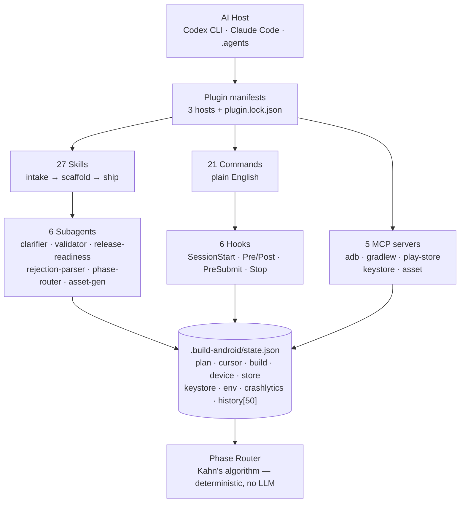

<p align="center">
  
</p>

<h1 align="center">Build Android App Plugin</h1>

<p align="center">
  <strong>The only plugin you need to build & ship Android apps from your AI assistant.</strong><br/>
  One prompt → working app → signed AAB on Play Store. No Kotlin. No Gradle. No Console maze.
</p>

<p align="center">
  <a href="LICENSE"></a>
  <a href="CHANGELOG.md"></a>
  <a href="SPEC.md"></a>
  
  
</p>

<p align="center">
  <a href="#quick-start">Quick start</a> •
  <a href="#how-it-works">How it works</a> •
  <a href="#skills">Skills</a> •
  <a href="#commands">Commands</a> •
  <a href="#install">Install</a> •
  <a href="SPEC.md">Spec</a> •
  <a href="CHANGELOG.md">Changelog</a>
</p>

---

> **Built for vibe coders, indie founders, and facilitators** — not Android engineers.
> If you can describe the app in one sentence, this plugin can build it.

```text
/make-app "a habit tracker with daily reminders and streaks"
# → asks 3 questions → writes spec → plans → scaffolds → builds → previews → ships
```

---

## Why this plugin

You type the idea. The plugin handles the rest — scaffold, state, signing, store listing, upload — and remembers where you left off.

| You say | Plugin does |
|---|---|
| `a habit tracker` | Intake → spec → plan (Kahn's algorithm, no LLM) → Compose scaffold with signing + Crashlytics |
| `/preview` | `adb` install → launch → screenshot → annotated layout dump |
| `/publish` | Pre-submit gate → signed AAB → Play Store internal track → draft URL |
| `add dark mode` mid-build | Mutates `state.json` → re-routes only affected phases |

**Resumable by design.** Every project gets `<project>/.build-android/state.json` (gitignored). `/add`, `/change`, `/undo`, `/where`, `/continue` all operate on that single source of truth.

---

## Quick start

**Prerequisites** — auto-detected on session start. Missing anything? `/setup` fixes it.

> JDK 17+ · Android SDK 35 · `adb` · Python 3.10+ · Play Console ($25 once) · service-account JSON

```bash
# 1 — one-time setup (~30 min, guided)
/setup

# 2 — build your first app
/make-app "a habit tracker with daily reminders"

# 3 — see it on device
/preview

# 4 — ship to Play Store (internal track)
/publish
```

<details>
<summary><strong>Regain control of an existing project?</strong></summary>

```bash
/import   # snapshot → audit → gap list (rollback-safe)
/audit    # deep Play Store readiness check
/finish   # auto-fill gaps → publish
```

</details>

---

## How it works



Every `/add` / `/change` / `/remove` / `/undo` mutates `state.json`. `/where` reads it. The router computes the minimal phase sequence to run.

---

## Features

- **One-liner to app** — `/make-app "<idea>"` runs intake (1–5 plain-English questions) → spec → sequenced plan → scaffold.
- **Mid-flight changes without restart** — `/add "user profiles"` patches the plan; only affected phases re-run.
- **Real device loop** — `/preview` and `/debug` drive `adb` (install, logcat, JDWP, layout dump) with a 3-strike fix loop.
- **Ship with confidence** — `/publish` is gated by `PreSubmit` (keystore, listing, screenshots must exist). `/why-rejected` diagnoses Play rejections by file.
- **Store assets from code** — `asset-mcp` generates launcher icons (5 densities + adaptive), feature graphic, screenshots.
- **Take ownership** — `/import` snapshots first, then audits any Lovable / Bolt / v0 / Cursor-built project.

---

## Skills

> 27 skills, each `skills/<name>/SKILL.md` + `references/`. Invoke with `$<skill>` (Codex) or `<skill>` (Claude).

<details open>
<summary><strong>Lifecycle (intake → plan → scaffold → run → ship)</strong></summary>

| Skill | Purpose | MCP |
|---|---|---|
| `app-intake` | Vague prompt → spec (1–5 questions) | state |
| `app-planner` | Spec → sequenced plan in `state.json` | state |
| `android-scaffold` | Gradle + Compose + signing + Crashlytics | gradlew |
| `android-run` | Install + launch + screenshot | adb |
| `android-debug-fix` | Logcat → localize → minimal fix (3-strike) | adb |
| `setup-wizard` | 10-step first-run onboarding | gradlew, play-store |

</details>

<details>
<summary><strong>App quality (UI · perf · test · edge-to-edge)</strong></summary>

| Skill | Purpose | MCP |
|---|---|---|
| `compose-ui-patterns` | Lists, nav, forms, state hoisting | — |
| `compose-performance-audit` | Recomposition, stability, baseline profiles | gradlew |
| `compose-view-refactor` | View → Compose migration | — |
| `material3-expressive` | M3 expressive theming | — |
| `android-edge-to-edge` | SDK 35 mandatory edge-to-edge | — |
| `android-test` *(via templates)* | Screenshot grid (400/610/900 × 400/500/1000 dp) | gradlew |

</details>

<details>
<summary><strong>Data, auth & platform</strong></summary>

| Skill | Purpose | MCP |
|---|---|---|
| `android-backend` | Room + DataStore + Supabase / Firebase | — |
| `android-auth` | Credential Manager, Google, passkey | — |
| `android-ops` | FCM, Analytics, WorkManager, Crashlytics | — |
| `android-media` | CameraX + Media3 ExoPlayer | — |
| `android-app-functions` | App Functions exposure | — |
| `android-restore-credentials` | Cross-device restore keys | — |
| `android-verified-email` | OTP-less SD-JWT verification | — |

</details>

<details>
<summary><strong>Shipping & optimization</strong></summary>

| Skill | Purpose | MCP |
|---|---|---|
| `android-icons-assets` | Icons (5 densities) + adaptive + feature graphic | asset |
| `android-store-listing` | Title, desc, screenshots, privacy, data safety | — |
| `android-publish-update` | Version bump + changelog + signed AAB + re-upload | play-store, keystore |
| `android-r8-analyzer` | APK size + keep-rule audit (30-line cap) | gradlew |
| `android-importer` | Own a foreign-built project (snapshot + audit) | gradlew |

</details>

<details>
<summary><strong>Diagnostics</strong></summary>

| Skill | Purpose | MCP |
|---|---|---|
| `android-profiler` | Perfetto / Simpleperf profiling | adb |
| `android-leak-analyzer` | Heap dump + leak analysis | adb |
| `android-debugger-agent` | JDWP attach + breakpoint flow | adb |
| `android-emulator-browser` | Emulator UI automation | adb |

</details>

---

## Commands

Plain English. No `gradlew` jargon.

| Command | Does |
|---|---|
| `/setup` | First-run wizard (SDK, Play Console, service account, keystore) |
| `/make-app "<idea>"` | New app from a one-liner |
| `/preview` | Install + launch + screenshot |
| `/publish` | Submit to Play Store internal track |
| `/update` | Bump version + changelog + resubmit |
| `/import` · `/audit` · `/finish` | Take over → check readiness → auto-fill & ship |
| `/add` · `/change` · `/remove` · `/undo` · `/continue` · `/where` | Mutate & navigate the plan |
| `/why-rejected` | Diagnose Play rejection by file |
| `/screenshots` · `/privacy-policy` · `/backup-keystore` | Store assets & safety |
| `/help` · `/status` · `/reset` | Help, post-publish dashboard, reset (double-confirm) |
| `/build` · `/run` · `/debug` · `/lint` · `/test` · `/clean` · `/log` · `/device` · `/crash` | Dev aliases |

Full reference: [`commands/`](commands/) · Spec: [`SPEC.md §11`](SPEC.md)

---

## MCP servers

All Python, stdio, dependency-light.

| Server | Tools | Highlights |
|---|---|---|
| **adb-mcp** | 17 | `list_devices`, `install_apk`, `start_activity`, `screencap`, `logcat_filter` (subscribable), `dump_layout` |
| **gradlew-mcp** | 12 | `list_tasks`, `run_task`, `describe_project`, `manage_sdk`, `run_help` / `run_build_dry`, `generate_keystore` |
| **play-store-mcp** | 9 | `auth`, `upload_aab`, `upload_listing`, `get_review_status`, `list_rejections`, `rollout_staged` |
| **keystore-mcp** | 5 | `generate`, `verify`, `rotate`, `backup`, `fingerprint` |
| **asset-mcp** | 4 | `generate_icon` (5 densities + adaptive), `generate_feature_graphic`, `generate_screenshot` |

Config: [`.mcp.json`](.mcp.json) — all five declared.

---

## Install

<table>
<tr><th>Codex CLI</th><th>Claude Code CLI</th><th>.agents hosts</th></tr>
<tr>
<td>

```bash
codex plugin install \
  github.com/mitunmanav/build-android-app-plugin
```

<details><summary>Local dev</summary>

```bash
git clone https://github.com/mitunmanav/build-android-app-plugin
codex --plugin-dir .
```
</details>

</td>
<td>

```bash
claude plugin marketplace add mitun/mitun
claude plugin install build-android-app-plugin@mitun
```

<details><summary>Local dev</summary>

```bash
git clone https://github.com/mitunmanav/build-android-app-plugin
claude --plugin-dir .
```
</details>

</td>
<td>

```bash
git clone https://github.com/mitunmanav/build-android-app-plugin \
  ~/.agents/plugins/build-android-app-plugin
# restart host: VS Code Copilot / Cursor / Gemini CLI …
```

</td>
</tr>
</table>

Optional — pair with Google's first-party skills for deeper coverage:

```bash
android skills add --all   # https://github.com/android/skills
```

---

## Compatibility

Pinned versions live in [`android-scaffold/references/versions-pinned.md`](skills/android-scaffold/references/versions-pinned.md).

| AGP | Gradle | Kotlin | Compose BOM | M3 | min SDK | target SDK | JVM |
|---|---|---|---|---|---|---|---|
| 8.7+ | 8.9+ | 2.0.21 | 2024.12.01 | 1.3.1 | 26 (Android 8, ~98%) | latest-stable | 17 |

Also pinned: Navigation 2.8.4 · Hilt 2.52 · Room 2.6.1 · DataStore 1.1.1 · CameraX 1.4.1 · Media3 1.4.1

---

## Limitations (v1.0)

| Out of scope | Planned |
|---|---|
| iOS, Wear, TV, Auto, XR | Sibling plugins |
| Raw custom backend hosting | v1.1 — Firebase + Supabase only today |
| Multi-user collaboration | v1.1 — single-user `state.json` |
| Advanced IAP / subscriptions | v1.1 — consumable template only |
| AGP 9.x | v1.1 — 8.7 is the stable target |
| Schema v2 migrations | v1.1 — only v1 supported |

---

## Pairs with

Complements, does not replace:

- [`openai/plugins/test-android-apps`](https://github.com/openai/plugins) — Perfetto / Simpleperf / heap dumps for power profiling.
- [`android/skills` (Google)](https://github.com/android/skills) — 16 first-party SKILLs (Compose, camera, media, perf, security…).
- [`ayush016/android-lead-agent-skills`](https://github.com/ayush016/android-lead-agent-skills) — team standards to copy into `AGENTS.md`.

---

## Contributing

PRs welcome.

1. `bash scripts/smoke.sh` — all 6 checks must pass
2. `smoke` workflow must pass on your PR
3. Update `CHANGELOG.md` (`[Unreleased]`) and `SPEC.md` if behavior changed
4. License stays [Apache-2.0](LICENSE) · author is **Mitun only** — no `Co-authored-by` footers

Conventions: [Semantic Versioning](https://semver.org) · [Keep a Changelog](https://keepachangelog.com/en/1.1.0/) · [open-standard SKILL.md](https://agentskills.io/specification) · Conventional Commits (informal)

See [`CONTRIBUTING.md`](CONTRIBUTING.md) · [`SECURITY.md`](SECURITY.md)

---

## License & author

[Apache-2.0](LICENSE) · [PRIVACY.md](PRIVACY.md) · [TERMS.md](TERMS.md)

**Mitun** — [github.com/mitunmanav](https://github.com/mitunmanav) · [mitunmanav933@gmail.com](mailto:mitunmanav933@gmail.com)

<p align="center"><sub>Shipped 2026-09-01 from Bangalore.</sub></p>
