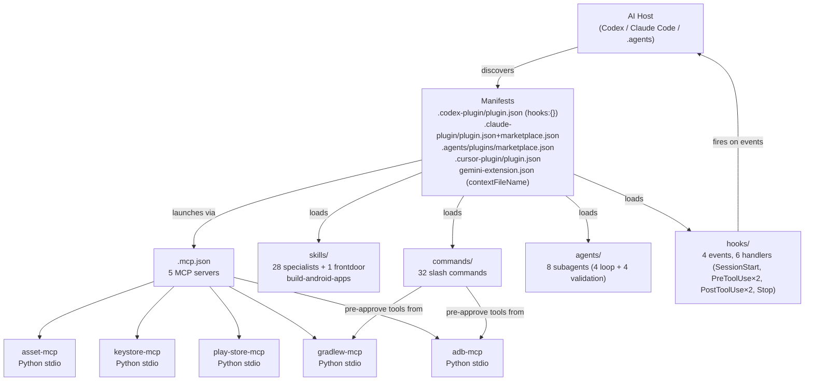

# Architecture



## Component responsibilities

| Component | Files | Purpose |
|---|---|---|
| **Manifests** | 3 JSON files | Tell each host what to load and how to display the plugin |
| **Skills** | `skills/<name>/SKILL.md` + `agents/openai.yaml` | 28 specialists + frontdoor `build-android-apps` + `agent-orchestrator` (autonomous plan-execution loop); progressive disclosure (frontdoor only at startup) |
| **Slash commands** | `commands/<name>.md` | 32 plain-English aliases that delegate to frontdoor |
| **Subagents** | `agents/<name>.md` | 4 loop agents (implementer, spec-reviewer, quality-reviewer, qa-user) + 4 validation agents (clarifier, validator, release-auditor, apk-inspector) |
| **Hooks** | `hooks/hooks.json` + 6 shell scripts | Lifecycle event handlers (SessionStart, PreToolUse×2, PostToolUse×2, Stop) |
| **MCP servers** | `mcp-servers/<name>/` (Python stdio) | 5 servers: adb, gradlew, play-store, keystore, asset |

## Request flow

```
User: /build            (Claude Code + Antigravity/Gemini; on Codex: "build the app" or @build-android-apps)
  ↓
Host loads commands/build.md → delegates to frontdoor $build-android-apps
  ↓
Frontdoor invokes mcp__plugin_build_android_apps_gradlew__run_task
  ↓
gradlew-mcp subprocess: ./gradlew assembleDebug
  ↓
Result returned to Codex
  ↓
Codex formats output
  ↓
User sees BUILD SUCCESSFUL in 4.2s
```

## Hook flow

```
SessionStart
  ↓
session-start (extensionless) + run-hook.cmd: detect ANDROID_HOME, adb, devices
  ↓
inject context into the agent's session

PreToolUse (Bash)
  ↓
block-destructive.sh: scan command for `gradlew clean`, `rm -rf`, etc.
  ↓
return permissionDecision: allow|deny

PostToolUse (Edit|Write|MultiEdit|apply_patch on *.kt)
  ↓
lint-kotlin.sh: run ktlint on the changed file
  ↓
inject lint findings as context

PostToolUse (Edit|Write|MultiEdit|apply_patch on *.kt)
  ↓
slop-gate.sh: block AI-slop residue
  ↓
deny or warn with repair prompt

PreToolUse (play-store submit/upload)
  ↓
release-check.sh: gate keystore/listing/screenshots
  ↓
allow or deny with plain-English reason

Stop
  ↓
stop-review.sh: print git diff stat summary
```
