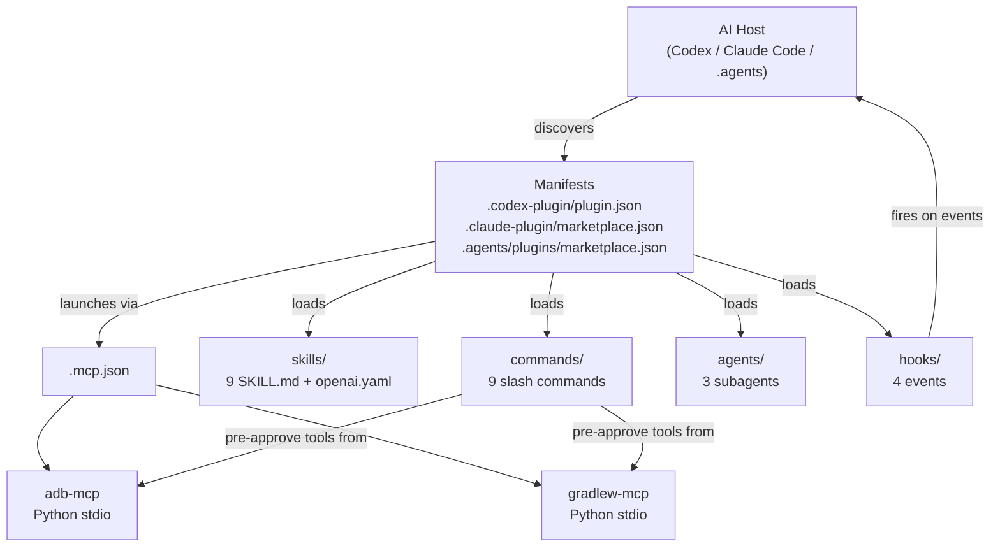

# Architecture



## Component responsibilities

| Component | Files | Purpose |
|---|---|---|
| **Manifests** | 3 JSON files | Tell each host what to load and how to display the plugin |
| **Skills** | `skills/<name>/SKILL.md` + `agents/openai.yaml` | Domain knowledge loaded on-demand by `$skill-name` |
| **Slash commands** | `commands/<name>.md` | Pre-approved tool sets invoked by `/name` |
| **Subagents** | `agents/<name>.md` | Parallel workers with their own system prompt |
| **Hooks** | `hooks/hooks.json` + 4 shell scripts | Lifecycle event handlers |
| **MCP servers** | `mcp-servers/<name>/` (Python) | Typed tool surface over adb + gradlew |

## Request flow

```
User: /build
  ↓
Codex loads commands/build.md
  ↓
Codex invokes mcp__plugin_build_android_app_plugin_gradlew__run_task
  ↓
gradlew-mcp subprocess: ./gradlew assembleDebug
  ↓
Result returned to Codex
  ↓
Codex formats output
  ↓
User sees BUILD SUCCESSFUL in 4.2s
```

## Hook flow

```
SessionStart
  ↓
session-start.sh: detect ANDROID_HOME, adb, devices
  ↓
inject context into the agent's session

PreToolUse (Bash)
  ↓
block-destructive.sh: scan command for `gradlew clean`, `rm -rf`, etc.
  ↓
return permissionDecision: allow|deny

PostToolUse (Edit|Write|MultiEdit on *.kt)
  ↓
lint-kotlin.sh: run ktlint on the changed file
  ↓
inject lint findings as context

Stop
  ↓
stop-review.sh: print git diff stat summary
```
